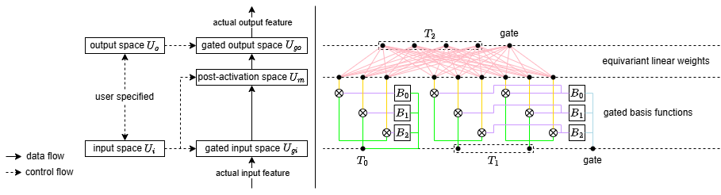
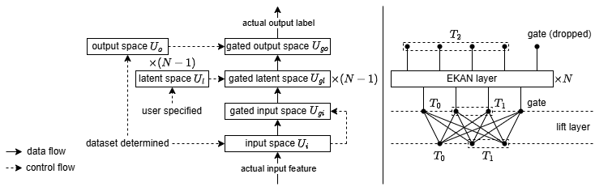

# Incorporating Arbitrary Matrix Group Equivariance into KANs  

This repository is the official implementation of the paper Incorporating Arbitrary Matrix Group Equivariance into KANs (ICML 2025).





## Requirements  

To install requirements:  

```shell
pip install -r requirements.txt
```

To install Adan:  

```shell
git clone https://github.com/sail-sg/Adan.git
cd Adan
python3 setup.py install --unfused
```

To download the top quark tagging dataset:  

```shell
wget -P ./data/TopTagging https://zenodo.org/records/2603256/files/train.h5 https://zenodo.org/records/2603256/files/val.h5 https://zenodo.org/records/2603256/files/test.h5
```

## Training  

### Particle Scattering  

To train the models on the particle scattering dataset:  

```shell
# EKAN
bash run_scripts/ParticleInteraction/EKAN.sh
# KAN
bash run_scripts/ParticleInteraction/KAN.sh
```

### Three-Body Problem

To train the models on the three-body problem dataset:  

```shell
# EKAN
bash run_scripts/3Body/EKAN.sh
# EMLP
bash run_scripts/3Body/EMLP.sh
# KAN
bash run_scripts/3Body/KAN.sh
# MLP
bash run_scripts/3Body/MLP.sh
```

### Top Quark Tagging

To train the models on the top quark tagging dataset ($n_{comp}=3$):  

```shell
# EKAN
bash run_scripts/TopTagging3/EKAN.sh
# EMLP
bash run_scripts/TopTagging3/EMLP.sh
# KAN
bash run_scripts/TopTagging3/KAN.sh
# MLP
bash run_scripts/TopTagging3/MLP.sh
# CGENN
cd CGENN
bash run_scripts/TopTagging3.sh
```

To train the models on the top quark tagging dataset ($n_{comp}=10$):  

```shell
# EKAN
bash run_scripts/TopTagging10/EKAN.sh
# EMLP
bash run_scripts/TopTagging10/EMLP.sh
# CGENN
cd CGENN
bash run_scripts/TopTagging10.sh
```

To train the models on the top quark tagging dataset ($n_{comp}=20$):  

```shell
# EKAN
bash run_scripts/TopTagging20/EKAN.sh
# EMLP
bash run_scripts/TopTagging20/EMLP.sh
# CGENN
cd CGENN
bash run_scripts/TopTagging20.sh
```

## Evaluation

### Particle Scattering  

To evaluate the test MSE of the models on the particle scattering dataset:  

```shell
# EKAN
bash run_scripts/ParticleInteraction/EKAN_test.sh
# KAN
bash run_scripts/ParticleInteraction/KAN_test.sh
```

To evaluate the equivariant error of the models on the particle scattering dataset:  

```shell
# EKAN
bash run_scripts/ParticleInteraction/EKAN_test_equi.sh
# KAN
bash run_scripts/ParticleInteraction/KAN_test_equi.sh
```

### Three-Body Problem

To evaluate the test MSE of the models on the three-body problem dataset:  

```shell
# EKAN
bash run_scripts/3Body/EKAN_test.sh
# EMLP
bash run_scripts/3Body/EMLP_test.sh
# KAN
bash run_scripts/3Body/KAN_test.sh
# MLP
bash run_scripts/3Body/MLP_test.sh
```

To evaluate the equivariant error of the models on the three-body problem dataset:  

```shell
# EKAN
bash run_scripts/3Body/EKAN_test_equi.sh
# EMLP
bash run_scripts/3Body/EMLP_test_equi.sh
# KAN
bash run_scripts/3Body/KAN_test_equi.sh
# MLP
bash run_scripts/3Body/MLP_test_equi.sh
```

### Top Quark Tagging

To evaluate the test accuracy of the models on the top quark tagging dataset ($n_{comp}=3$):  

```shell
# EKAN
bash run_scripts/TopTagging3/EKAN_test.sh
# EMLP
bash run_scripts/TopTagging3/EMLP_test.sh
# KAN
bash run_scripts/TopTagging3/KAN_test.sh
# MLP
bash run_scripts/TopTagging3/MLP_test.sh
# CGENN
cd CGENN
bash run_scripts/TopTagging3_test.sh
```

To evaluate the equivariant error of the models on the top quark tagging dataset ($n_{comp}=3$):  

```shell
# EKAN
bash run_scripts/TopTagging3/EKAN_test_equi.sh
# EMLP
bash run_scripts/TopTagging3/EMLP_test_equi.sh
# KAN
bash run_scripts/TopTagging3/KAN_test_equi.sh
# MLP
bash run_scripts/TopTagging3/MLP_test_equi.sh
```

To evaluate the test accuracy of the models on the top quark tagging dataset ($n_{comp}=10$):  

```shell
# EKAN
bash run_scripts/TopTagging10/EKAN_test.sh
# EMLP
bash run_scripts/TopTagging10/EMLP_test.sh
# CGENN
cd CGENN
bash run_scripts/TopTagging10_test.sh
```

To evaluate the test accuracy of the models on the top quark tagging dataset ($n_{comp}=20$):  

```shell
# EKAN
bash run_scripts/TopTagging20/EKAN_test.sh
# EMLP
bash run_scripts/TopTagging20/EMLP_test.sh
# CGENN
cd CGENN
bash run_scripts/TopTagging20_test.sh
```

## Citation

```bibtex
@inproceedings{hu2025incorporating,
  title={Incorporating Arbitrary Matrix Group Equivariance into KANs},
  author={Hu, Lexiang and Wang, Yisen and Lin, Zhouchen},
  booktitle={International Conference on Machine Learning},
  pages={24744--24760},
  year={2025},
  organization={PMLR}
}
```
